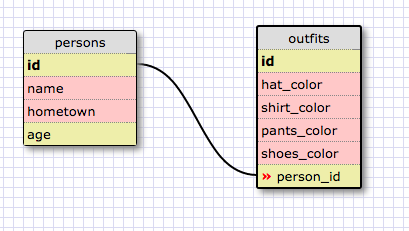

1: SELECT * FROM states;
2: SELECT * FROM regions;
3: SELECT state_name, population FROM states;
4: SELECT state_name, population FROM states ORDER BY population DESC;
5: SELECT state_name FROM states WHERE region_id = 7;
6: SELECT state_name, population_density FROM states WHERE population_density > 50 ORDER BY population_density ASC;
7: SELECT state_name FROM states WHERE population BETWEEN 1000000 AND 1500000;
8: SELECT state_name, region_id FROM states ORDER BY region_id ASC;
9: SELECT region_name FROM regions where region_name LIKE '%Central%';
10: SELECT regions.region_name, states.state_name FROM regions INNER JOIN states ON regions.id=states.region_id;

Reflection:
Databases are used to organize, store, and categorize data (often in large quantities).

A one-to-many relationship can best be explained as a relationship between two
elements where element A belongs to ONE of element B, and element B has
MANY of element A.

A primary key is a field in a table that uniquely identifies each row in the table.
Each table can only have one primary key, while a foreign key is a field in one
table that points to the primary
key of another table.

You can select information from SQL databases using the appropriate keywords
like SELECT, FROM, GROUP BY, ORDER BY, ASC, DESC. Some good guidlines:
It's a good idea to use "SELECT * FROM" when you want to select all elements,
also you can use % as a wildcard character, and WHERE is a good keyword for
stating the conditions that you want to select from.
