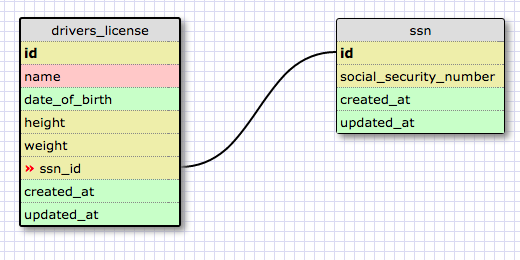

A one-to one database is a database consisting of two categories that have
a single relationship to each other. You would want to use this when category A
can have at most ONE of category B (but might not have any), and category B has
only one of category A.

A many-to-many database is a database where each category can have more than one
of the other categories in the database. You would use one of these to store and organize
data when two (or more) things have multiple relationships to one another.

In general, database schemas make sense although initially it can be tough to grasp
why you would want to use a one-to-one database.